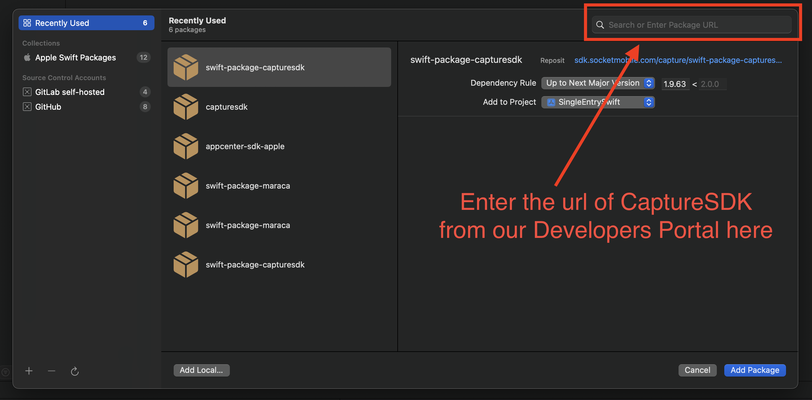

# SingleEntrySwift for iOS

Simple iOS app showing the use of with `CaptureSDK` as a Swift Package Manager.

## IMPORTANT

As of today, the url of `CaptureSDK` Swift Package Manager contains an Access Token that we cannot display publicly here.

**Please go to our [Developers Portal](https://www.socketmobile.com/developers/portal) to get the url with this Access Token.**

Then add our `CaptureSDK` as Swift Package in Xcode in the project settings in the tab `Package Dependencies`:

## Prerequisites

The Socket Mobile `CaptureSDK` is required in order to compile this sample.

## Documentation

The `CaptureSDK` documentation can be found [here](https://docs.socketmobile.com/capture/ios/en/latest/swift.html "Capture SDK documentation").

## Installation

Clone the project and open `SingleEntrySwift.xcodeproj`

It is very important to make sure your application's `info.plist` file contains the following:

- `LSApplicationQueriesSchemes (Queried URL Schemes)` with a new array item: `sktcompanion` (in lower case).

- `UISupportedExternalAccessoryProtocols` the supported external accessory protocol array item `com.socketmobile.chs` (Adding the external accessory protocol string to your application will require your application to be whitelisted with Socket Mobile before submission to the App Store.). Make sure to contact Socket Mobile in order to whitelist your application.  You can submit your app to be whitelisted in the Socket Mobile Developer portal.

- `CFBundleAllowMixedLocalizations` to `YES`

- `NSCameraUsageDescription` string to a reason to use our camera scanning feature SocketCam

- `NSBluetoothAlwaysUsageDescription` string to a reason to use Bluetooth connection

Then you will have to generate your application credentials with the application bundle identifier of your choice from our Developers Portal and paste those credentials into the `SingleEntryViewController.swift` line 103 to 105 to be able to open our `CaptureSDK`. If you get an error `-19` when opening `CaptureSDK`, it means that your credentials are wrong and/or your application bundle identifier is not the same than your credentials.

Build and run the application on a device in order to test with a Socket Mobile device or to test our camera scanning SocketCam.

## Screenshots

### Main View

The main view shows the connection status, an edit box that receives the decoded data and a "settings" link to display the settings view. When a scanner is connected, its friendly name appears in the status.

## Description

SingleEntrySwift displays a scanner connection status.

When a scanner is connected, its friendly name is displayed.

The edit box receives the decoded data from the scanner.

## CaptureHelper Implementation

We recommend you to use `CaptureHelper` as it helps you to write boilerplate code for many `CaptureSDK` operations.

In this simple example the `CaptureHelper` is "attached" to the main view controller.

This main view controller derives from the `CaptureHelperDevicePresenceDelegate`, `CaptureHelperDeviceDecodedDataDelegate`, `CaptureHelperErrorDelegate` and `CaptureHelperDevicePowerDelegate` protocols and implements their respective delegate methods.

### CaptureHelper shared instance feature

As a showcase, this sample application shows the `CaptureHelper` shared instance.

The purpose of this feature is to share CaptureHelper across the view hierarchy without the need to pass between the views an explicit reference to CaptureHelper.

When a view using `CaptureHelper` is active, it pushes its delegate using the `CaptureHelper` `pushDelegate` method which makes this view active to receive
notifications from `CaptureHelper`.

The first notification the view might receive could be `didNotifyArrivalForDevice`, when a Socket Mobile device is already connected to the host, even though other views may have already received this notification.

Once the view becomes inactive, then it should call the `CaptureHelper` `popDelegate` to remove itself from receiving notification.

At this point, the prior view, if it exists, that had pushed its delegate becomes the one receiving the notifications.  

### Main view controller viewDidLoad

The viewDidLoad handler opens `CaptureHelper` just after pushing its own reference as the delegate requiring the MainViewController to derive from one the CaptureHelperDelegate protocol.
There is a bunch of protocols to choose from depending on what Capture notifications the application is interested.

### CaptureHelper openWithAppInfo

This is the fist method to call in order to be able to use Capture.

The application information should be set accordingly to the information provided during the [application registration](http://www.socketmobile.com/developer/appkey-registration "Application Registration") in the Socket Mobile developer portal.

This method must be called only once in the entire application.

The completion handler confirms if Capture has been opened successfully. Bear in mind that the open is an asynchronous method.

**NOTE**: It is not recommended to close Capture because this forces Capture to reinitialize the Socket Mobile device the next time the application opens Capture. Closing Capture does not save more power and if the application does not want to receive any events from Capture, it can just call `popDelegate` method as explained above.

### didNotifyArrivalForDevice

This CaptureHelperDevicePresenceDelegate method is called when a scanner is
successfully detected by the host. The scanner can be SoftScan or any other
Socket Mobile scanners supported by Capture.

### didNotifyRemovalForDevice

This CaptureHelperDevicePresenceDelegate method is called when a scanner is no
longer available (disconnected).

### didReceiveDecodedData

This CaptureHelperDeviceDecodedDataDelegate method is called when a barcode has
been successfully decoded by the scanner.

## CaptureHelper

`CaptureHelper` is provided as source code. It provides a set of very basic features like enabling disabling barcode symbologies.

If a needed feature is not implemented by `CaptureHelper`, the recommendation is
to create a `CaptureHelper` extension and copy paste a feature similar from
`CaptureHelper` class to the extended one.

An example of this **CaptureHelper extension** is shown in the `CaptureHelperExtension.swift`

## Host Acknowledgment

For some applications it might be required to check the decoded data before letting the user scan more barcodes.
This feature is shown with the code enclosed in #if HOST_ACKNOWLEDGMENT statement.

To activate this feature go to the project settings and in the "Other Swift Flags" rename this "-DNO_HOST_ACKNOWLEDGMENT" to this "-DHOST_ACKNOWLEDGMENT".
