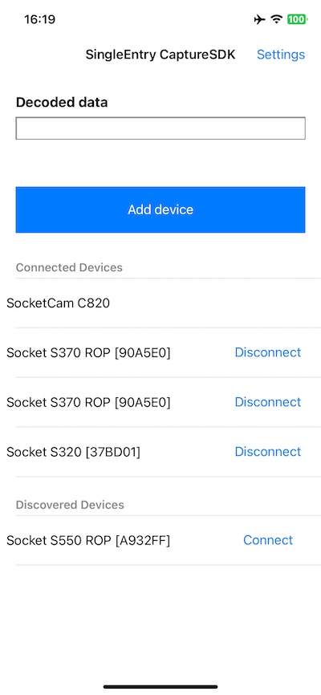

# SingleEntrySwift for iOS

Simple iOS app showing the use of our [`iOS CaptureSDK` as a Swift Package Manager](https://github.com/SocketMobile/swift-package-capturesdk/releases/tag/2.0.16).

## Prerequisites

The [Socket Mobile `CaptureSDK`](https://github.com/SocketMobile/swift-package-capturesdk) is required in order to compile this sample.

## Documentation

The `CaptureSDK` [documentation can be found here](https://docs.socketmobile.com/capture/ios/en/latest/gettingStarted.html#using-capturesdk).

## Installation

Clone the project and open `SingleEntrySwift.xcodeproj`

It is very important to make sure your application's `info.plist` file contains the following:

- `LSApplicationQueriesSchemes (Queried URL Schemes)` with a new array item: `sktcompanion` (in lower case).

- `UISupportedExternalAccessoryProtocols` the supported external accessory protocol array item `com.socketmobile.chs` (Adding the external accessory protocol string to your application will require your application to be whitelisted with Socket Mobile before submission to the App Store.). Make sure to contact Socket Mobile in order to whitelist your application.  You can submit your app to be whitelisted in the Socket Mobile Developer portal.

- `CFBundleAllowMixedLocalizations` to `YES`

- `NSCameraUsageDescription` string to a reason to use our camera scanning feature SocketCam

- `NSBluetoothAlwaysUsageDescription` string to a reason to use Bluetooth connection

Build and run the application on a device in order to test with a Socket Mobile device or to test our camera scanning SocketCam.

## Screenshots

### Main View

The main view shows the connection status, an edit box that receives the decoded data and a "settings" link to display the settings view. When a device is connected, its friendly name appears in the status.



## Description

SingleEntrySwift displays discovered devices and connected devices.

The edit box receives the decoded data from the connected devices.

This sample application and code is an example of quick implementation without our [Socket Mobile Companion app]

You can discover and connect to Socket Mobile devices in your own application's flow. We advise you to create some UI where you can handle the discovery of the discovered devices and a list of conencted devices that will remain as favorites as long as you don't disconnect them. Otherwise they will reconnect automatically once in the vicinity of your iOS device. In order to not connect to a previously connected device you need to remove it.

## CaptureHelper Implementation

We recommend you to use `CaptureHelper` as it helps you to write boilerplate code for many `CaptureSDK` operations.

In this simple example the `CaptureHelper` is "attached" to the main view controller.

### CaptureHelper shared instance feature

As a showcase, this sample application shows the `CaptureHelper` shared instance.

The purpose of this feature is to share CaptureHelper across the view hierarchy without the need to pass between the views an explicit reference to CaptureHelper.

When a view using `CaptureHelper` is active, it pushes its delegate using the `CaptureHelper` `pushDelegate` method which makes this view active to receive notifications from `CaptureHelper`.

The first notification the view might receive could be `didNotifyArrivalForDevice`, when a Socket Mobile device is already connected to the host, even though other views may have already received this notification.

Once the view becomes inactive, then it should call the `CaptureHelper` `popDelegate` to remove itself from receiving notification.

At this point, the prior view, if it exists, that had pushed its delegate becomes the one receiving the notifications.  

### Main view controller viewDidLoad

The viewDidLoad handler opens `CaptureHelper` just after pushing its own reference as the delegate requiring the MainViewController to derive from one the CaptureHelperDelegate protocol.

There is a bunch of protocols to choose from depending on what CaptureSDK notifications the application is interested.

### CaptureHelper openWithAppInfo

This is the fist method to call in order to be able to use CaptureSDK.

The application information should be set accordingly to the information provided during the [application registration](http://www.socketmobile.com/developer/appkey-registration "Application Registration") in the Socket Mobile developer portal.

This method must be called only once in the entire application.

The completion handler confirms if Capture has been opened successfully. Bear in mind that the open is an asynchronous method.

**NOTE**: It is **NOT** recommended to close CaptureSDK because this forces CaptureSDK to reinitialize the Socket Mobile device the next time the application opens CaptureSDK. Closing CaptureSDK does not save more power and if the application does not want to receive any events from CaptureSDK, it can just call `popDelegate` method as explained above.

## Devices discovery

PLEASE NOTE THAT OUR DEVICES ARE MAINLY BLUETOOTH CLASSIC AND WE'RE TRANSITIONING TO BLUETOOTH LOW ENERGY DEVICES.

THINK ABOUT DOING A BLUETOOTH CLASSIC DISCOVERY AS YOUR CUSTOMERS MAY STILL HAVE THOSE DEVICES FOR A WHILE.

YOU CAN CHOSE WHICH BLUETOOTH LOW ENERGY OR CLASSIC YOU WANT TO DISCOVER FIRST.

### Adding a Bluetooth Low Energy device

Launch the discovery for Bluetooth LE devices in your own UI or directly once the Device Manager is available. Or in the flow of your application like the Peripherals' settings:

```Swift
func didNotifyArrivalForDeviceManager(_ device: CaptureHelperDeviceManager, withResult result: SKTResult) {
    print("didNotifyArrivalForDeviceManager: \(String(describing: device.deviceInfo.name))")
    // Retain the device manager for later purpose
    self.deviceManager = deviceManager

    // Here we start the discovery with 'addBluetoothDevice' and the parameter '.bluetoothLowEnergy'
    captureHelper.addBluetoothDevice(.bluetoothLowEnergy , withCompletionHandler: { result in
        print("addBluetoothDevice - Bluetooth Low Energy: \(result.rawValue)")
    })

    // Here you can show your own UI to show the discovered devices
    showMyDiscoveryUI()
}
```

Then for each discovered device the `didDiscoverDevice` delegate is called. We advise you to keep an array of discovered devices to show them in your own UI:

```Swift
func didDiscoverDevice(_ device: SKTCaptureDiscoveredDeviceInfo, fromDeviceManager deviceManager: CaptureHelperDeviceManager) {
    print("didDiscoverDevice: \(device.name) - \(device.identifierUuid)")

    // Keep the discovered device in an array to show them in your own UI
    self.discoveredDevices.append(device)
    self.myDiscoveryTableView.reloadData()
}
```

The device discovery ends once the time out has elapsed and notifies your app by calling the `didDiscoveryEndWithResult` delegate:

```Swift
func didEndDiscoveryWithResult(_ result: SKTResult, fromDeviceManager deviceManager: CaptureHelperDeviceManager) {
    print("end discovery with result: \(result.rawValue)")
}
```

## Connect to a Discovered device

To connect to a discovered device, use the Capture Helper API `connectToDiscoveredDevice` by using the Device Manager retained earlier:

```Swift
self.deviceManager.connectToDiscoveredDevice(selectedDiscoveredDevice) { result in
    print("connectToDiscoveredDevice: \(result.rawValue)")

    // Keep the connected device in an array to show them in your own UI
    self.connectedDevices.append(device)
    self.myConnectedDevicesTableView.reloadData()
}
```

## Removing a device

To remove a device, use the Capture Helper API `removeBluetoothDevice`. Pass the device’s GUID to remove it:

```Swift
if let deviceGuid = device.deviceInfo.guid {
    captureHelper.removeBluetoothDevice(deviceGuid) { result in
        print("removeBluetoothDevice: \(result.rawValue)")

        // Update the connected devices array to update your own UI
        if result == .E_NOERROR {
            if let index = self.connectedDevices.firstIndex(of: device) {
                self.connectedDevices.remove(at: index)
                self.myConnectedDevicesTableView.reloadData()
            }
        }
    }
}
```

### Adding a Bluetooth Classic device

```Swift
// Here we start the discovery with 'addBluetoothDevice' and the parameter '.bluetoothClassic'
captureHelper.addBluetoothDevice(.bluetoothClassic , withCompletionHandler: { result in
    print("addBluetoothDevice - Bluetooth Classic: \(result.rawValue)")
})
```

NB: Our Bluetooth Classic devices are connected to the iOS Bluetooth Settings so your application will receive directly `didNotifyArrivalForDevice` if it is properly setup in **Application Mode** with the following barcode:


### didNotifyArrivalForDevice

This `CaptureHelperDevicePresenceDelegate` method is called when a device is successfully detected by the host. The device can be SocketCam or any other Socket Mobile devices supported by CaptureSDK.

### didNotifyRemovalForDevice

This `CaptureHelperDevicePresenceDelegate` method is called when a device is no longer available (disconnected).

### didReceiveDecodedData

This `CaptureHelperDeviceDecodedDataDelegate` method is called when a barcode has been successfully decoded by the device.

### didChangeBatteryLevel

This `CaptureHelperDevicePowerDelegate` method is called when the battery level of a device has changed.

## CaptureHelper

`CaptureHelper` is provided as source code. It provides a set of very basic features like enabling disabling barcode symbologies.

If a needed feature is not implemented by `CaptureHelper`, the recommendation is to create a `CaptureHelper` extension and copy paste a feature similar from `CaptureHelper` class to the extended one.

An example of this **CaptureHelper extension** is shown in the `CaptureHelperExtension.swift`

## Host Acknowledgment

For some applications it might be required to check the decoded data before letting the user scan more barcodes.

This feature is shown with the code enclosed in #if HOST_ACKNOWLEDGMENT statement.

To activate this feature go to the project settings and in the "Other Swift Flags" rename this "-DNO_HOST_ACKNOWLEDGMENT" to this "-DHOST_ACKNOWLEDGMENT".
