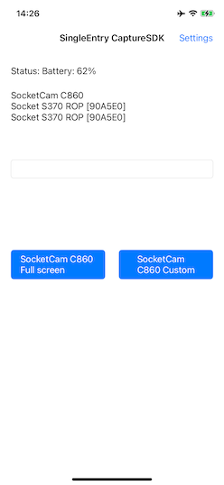

# SingleEntrySwift for iOS
Simple iOS app showing the use of Capture SDK.

## IMPORTANT
When using/installing CocoaPods in a new project, the project workspace file should be used instead of the project file.

The Socket Mobile Bluetooth barcode scanners and RFID Readers use the External Accessory Framework.

It is very important to make sure your application info plist file contains the supported external accessory protocol string array `com.socketmobile.chs`.


The previous version of iOS used to give an error message in the traces when a barcode scanner connects to the iOS device and the protocol string was omitted, but that is no longer the case with the most recent version of iOS.

Adding the external accessory protocol string to your application will require your application to be whitelisted with Socket Mobile before submission to the App Store.

Make sure to contact Socket Mobile in order to whitelist your application.  You can submit your app to be whitelisted in the Socket Mobile Developer portal.

## Prerequisites
The Capture SDK uses CocoaPods. If it needs to be installed, please check the [CocoaPods website](https://cocoapods.org/ "CocoaPods Homepage") for the most current instructions.

The Socket Mobile Capture SDK is required in order to compile this sample.

## Documentation
The Capture SDK documentation can be found [here](https://docs.socketmobile.com/capture/ios/en/latest/swift.html "Capture SDK documentation").

## Installation
The following steps show how to get and build this project.

Open a Terminal window and clone the project:
`git clone https://github.com/SocketMobile/capturesingleentryswift-ios.git && cd capturesingleentryswift-ios`

Then install Socket Mobile Capture SDK:
`pod install`

Last, open the SingleEntry Xcode workspace file:
`open SingleEntrySwift.xcworkspace`

It is important to load the SingleEntrySwift workspace (NOT PROJECT) in Xcode and compile and run.

Build and run the application on a device in order to test with a Socket Mobile device.

## Remarks about Podfile
There are 2 Capture Cocoapods that are provided. For a Swift project, it is better to use SKTCapture which has the CaptureHelper class written directly in Swift.

The second Capture CocoaPods, SKTCaptureObjC has CaptureHelper written in Objective-C.

### use_frameworks! is no longer required
Since cocoapods version 1.5.0 and Xcode 9, use_frameworks is no longer necessary.

In this configuration the source files using Capture should include a
`import SKTCapture` at the beginning of the source file.
There is no need of a Bridging Header file.

Here is an example of such Podfile:
```
def import_pods
  pod 'SKTCapture', '~> 1.1'
end

platform :ios, '8.0'
target 'SingleEntrySwift'
import_pods

```

The source file using CaptureHelper could look like this:
```
import UIKit
import SKTCapture

class DetailViewController: UIViewController,
  CaptureHelperDevicePresenceDelegate,
  CaptureHelperDeviceDecodedDataDelegate {
    let noScannerConnected = "No scanner connected"
    var scanners : [NSString] = []  // keep a list of scanners to display in the status
    var softScanner : CaptureHelperDevice?  // keep a reference on the SoftScan Scanner

...
```

## IMPORTANT NOTES
In Xcode the debug information format in the build options is set by default to
'DWARF with DSYM file'. This is causing numerous warnings. It is recommended to
set it back to 'DWARF' instead.

## Screenshots

### Home View
The home view shows a list view with just one item: SingleEntry.

This view serves just as a demo of an application with multiple views. This view is aware about Capture, but does really nothing when a Socket Mobile device connects or scans a barcode.


### Main View
The main view shows the connection status, an edit box that receives the decoded data and a "settings" link to display the settings view.

When a scanner is connected, its friendly name appears in the status.



### Settings View
The settings view displays the Capture version, two switches to turn on or off the SoftScan feature and the D600 support. The done link closes this view to go back to the main view.


## Description
SingleEntrySwift displays a scanner connection status. When a scanner is
connected, its friendly name is displayed.
The edit box receives the decoded data from the scanner.


## Implementation
Since the Capture Helper is written in Swift it can be used directly in
a Swift project.

To use it in the source code, a simple `import SKTCapture` is required
at the beginning of the file.

In this simple example the CaptureHelper is "attached" to the main view
controller.

This main view controller derives from the CaptureHelperDevicePresenceDelegate,
CaptureHelperDeviceDecodedDataDelegate, CaptureHelperErrorDelegate and
CaptureHelperDevicePowerDelegate protocol and implements their respective delegate methods.

### CaptureHelper shared instance feature
As a showcase, this sample application shows the CaptureHelper shared instance feature.

The purpose of this feature is to share CaptureHelper across the view hierarchy
without the need to pass between the views an explicit reference to CaptureHelper.

When a view using CaptureHelper is active, it pushes its delegate using the CaptureHelper `pushDelegate` method which makes this view active to receive
notifications from CaptureHelper.

The first notification the view might receive could be `didNotifyArrivalForDevice`, when a Socket Mobile device is already connected to the host, even though other views may have already received this notification.

Once the view becomes inactive, then it should call the CaptureHelper `popDelegate` to remove itself from receiving notification.

At this point, the prior view, if it exists, that had pushed its delegate becomes the one receiving the notifications.  

### Main view controller viewDidLoad
The viewDidLoad handler opens CaptureHelper just after pushing its own reference as the delegate requiring the MainViewController to derive from one the CaptureHelperDelegate protocol.
There is a bunch of protocols to choose from depending on what Capture notifications the application is interested.

### CaptureHelper openWithAppInfo
This is the fist method to call in order to be able to use Capture.

The application information should be set accordingly to the information provided during the [application registration](http://www.socketmobile.com/developer/appkey-registration "Application Registration") in the Socket Mobile developer portal.

This method must be called only once in the entire application.

The completion handler confirms if Capture has been opened successfully. Bear in
mind that the open is an asynchronous method, it will return right away.

**NOTE**: It is not recommended to close Capture because this forces Capture to reinitialize the Socket Mobile device the next time the application opens Capture. Closing Capture does not save more power and if the application does not want to receive any events from Capture, it can just call `popDelegate` method as explained above.

### didNotifyArrivalForDevice
This CaptureHelperDevicePresenceDelegate method is called when a scanner is
successfully detected by the host. The scanner can be SoftScan or any other
Socket Mobile scanners supported by Capture.

### didNotifyRemovalForDevice
This CaptureHelperDevicePresenceDelegate method is called when a scanner is no
longer available (disconnected).

### didReceiveDecodedData
This CaptureHelperDeviceDecodedDataDelegate method is called when a barcode has
been successfully decoded by the scanner.

# CaptureHelper
CaptureHelper is provided as source code. It provides a set of very basic
features like enabling disabling barcode symbologies.

If a needed feature is not implemented by CaptureHelper, the recommendation is
to create a CaptureHelper extension and copy paste a feature similar from
CaptureHelper class to the extended one.

Following this recommendation will prevent to lose the modifications at the
next update of the Capture CocoaPods.

An example of this **CaptureHelper extension** is shown in the CaptureHelperExtension.swift

# Host Acknowledgment
For some applications it might be required to check the decoded data before
letting the user scan more barcodes.
This feature is shown with the code enclosed in #if HOST_ACKNOWLEDGMENT
statement.

To activate this feature go to the project settings and in the "Other Swift
Flags" rename this "-DNO_HOST_ACKNOWLEDGMENT" to this "-DHOST_ACKNOWLEDGMENT".
